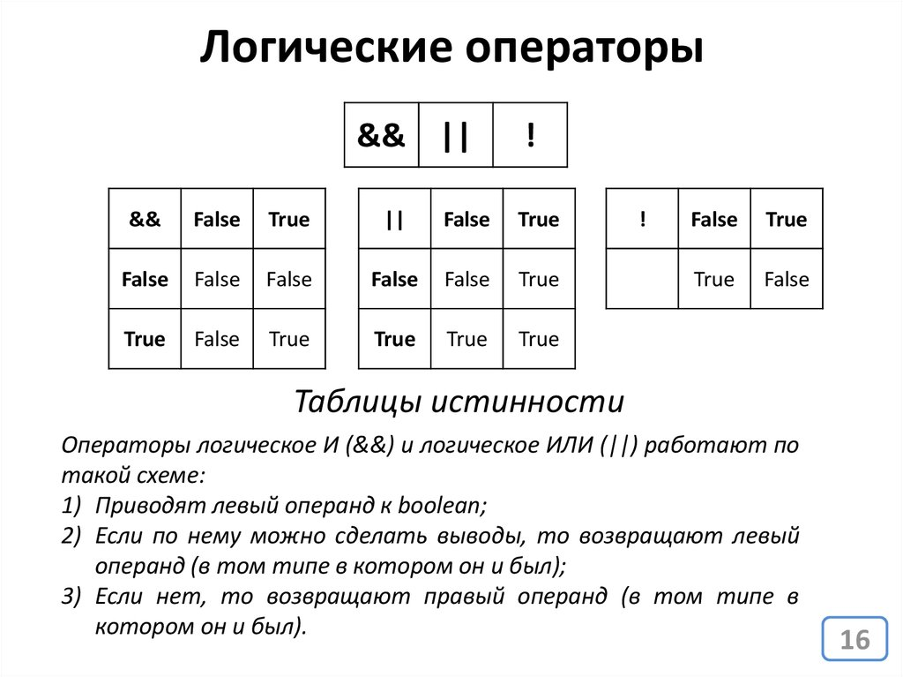

# Структура програмы

Tags: Web dev

**Лекция: Структура программ в JavaScript**

---

**1. Введение**

Представьте, что вы строите дом. Ваш дом — это программа на JavaScript, а инструменты и материалы, которые вы используете, — это переменные, функции, циклы и условия.

---

**2. Переменные**

Переменные — это коробки в вашем доме, в которых вы храните разные вещи.

- **Объявление переменных:** Создание коробки.

  ```jsx
  let имя = значение;
  ```

- **Пример:** Создаем коробку с именем `age` и кладем в нее значение `25`.

  ```jsx
  let age = 25;
  ```

[Переменные в Javascript](https://www.notion.so/Javascript-ae6e602be4e743c582e8fb1b415096c5?pvs=21)

[https://snappify.com/embed/27eb1e6f-4c23-46d1-8b3d-ede4d314c6cc?responsive=1](https://snappify.com/embed/27eb1e6f-4c23-46d1-8b3d-ede4d314c6cc?responsive=1)

---

**3. Функции**

Функции — это рецепты приготовления блюд. Вы можете следовать рецепту (вызывать функцию) каждый раз, когда хотите приготовить блюдо (получить результат).

- **Объявление функции:**

  ```jsx
  function имя(параметры) {
    // тело функции
    return результат;
  }
  ```

- **Пример:** Рецепт приготовления смузи.

  ```jsx
  function makeSmoothie(fruit1, fruit2) {
    return `Смузи из ${fruit1} и ${fruit2}`;
  }
  ```

---

[https://snappify.com/embed/9e8eec3b-0721-4970-90d7-b975dc569ea0?responsive=1](https://snappify.com/embed/9e8eec3b-0721-4970-90d7-b975dc569ea0?responsive=1)

**4. Циклы**

Представьте, что у вас есть коробка конфет, и вы хотите взять каждую конфету по очереди, пока коробка не опустеет. Вместо того чтобы повторять одно и то же действие (брать конфету) множество раз, вы можете использовать цикл в программировании, чтобы автоматизировать этот процесс.

---

**2. Цикл `for`**

Цикл `for` — это как инструкция: "Сделай это заданное количество раз".

**Пример:** Возьмем 5 конфет из коробки.

```jsx
for (let i = 0; i < 5; i++) {
  console.log("Взял конфету номер " + (i + 1));
}
```

Здесь:

- `let i = 0` — это начальное условие (начинаем с первой конфеты).
- `i < 5` — это условие продолжения (продолжаем, пока не возьмем 5 конфет).
- `i++` — это действие после каждой итерации (переходим к следующей конфете).

---

**3. Цикл `while`**

Цикл `while` — это как инструкция: "Делай это, пока выполняется условие".

**Пример:** Возьмем конфеты из коробки, пока в ней что-то есть.

```jsx
let candies = 10;

while (candies > 0) {
  console.log("Взял конфету. Осталось: " + --candies);
}
```

Здесь цикл будет выполняться, пока количество конфет в коробке больше нуля.

---

**4. Цикл `do...while`**

Этот цикл похож на `while`, но сначала выполняет действие, а затем проверяет условие.

**Пример:** Возьмем хотя бы одну конфету, даже если коробка почти пуста.

```jsx
let candies = 0;

do {
  console.log("Взял конфету. Осталось: " + candies);
} while (candies > 0);
```

Даже если конфет в коробке не было изначально, мы все равно попробуем взять одну.

---

**5. Управление циклами: `break` и `continue`**

- `break` — это как команда "Хватит! Остановись прямо сейчас!".
- `continue` — это как команда "Пропусти этот шаг и продолжай дальше".

**Пример с `break`:** Возьмем конфеты, пока не найдем зеленую.

```jsx
let box = ["красная", "синяя", "зеленая", "желтая"];

for (let i = 0; i < box.length; i++) {
  if (box[i] === "зеленая") {
    console.log("Нашел зеленую конфету! Я закончил.");
    break;
  }
  console.log("Взял " + box[i] + " конфету.");
}
```

**Пример с `continue`:** Возьмем все конфеты, кроме зеленых.

```jsx
for (let i = 0; i < box.length; i++) {
  if (box[i] === "зеленая") {
    console.log("Пропускаю зеленую конфету.");
    continue;
  }
  console.log("Взял " + box[i] + " конфету.");
}
```

---

**5. Условные операторы**

Представьте, что вы стоите перед дверью с автоматическим замком. Если у вас есть ключ (истина), дверь откроется. Если ключа нет (ложь), дверь останется закрытой. Условные операторы и булевая логика в программировании работают по такому же принципу: они позволяют вашему коду принимать решения на основе определенных условий.

---

**2. Условные операторы**

Условные операторы позволяют выполнять разные действия в зависимости от того, истинно или ложно определенное условие.

- **Оператор `if`**: "Если условие истинно, сделай это".

  ```jsx
  if (условие) {
    // действие, если условие истинно
  }
  ```

- **Оператор `else`**: "Если условие в `if` ложно, сделай другое".

  ```jsx
  if (условие) {
    // действие, если условие истинно
  } else {
    // действие, если условие ложно
  }
  ```

- **Оператор `else if`**: "Если предыдущее условие ложно, проверь другое условие".

  ```jsx
  if (условие1) {
    // действие для условия1
  } else if (условие2) {
    // действие для условия2
  } else {
    // действие, если оба условия ложны
  }
  ```

---

**3. Булевая логика**

Булевая логика основана на концепции истины и лжи. В JavaScript истинные значения интерпретируются как `true`, а ложные — как `false`.

- **Логическое И (`&&`)**: Возвращает `true`, если оба условия истинны.

  ```jsx
  if (условие1 && условие2) {
    // действие, если оба условия истинны
  }
  ```

- **Логическое ИЛИ (`||`)**: Возвращает `true`, если хотя бы одно из условий истинно.

  ```jsx
  if (условие1 || условие2) {
    // действие, если хотя бы одно из условий истинно
  }
  ```

- **Логическое НЕ (`!`)**: Инвертирует булево значение.

  ```jsx
  if (!условие) {
    // действие, если условие ложно
  }
  ```

---

**4. Примеры**

Представьте, что у вас есть светофор:

- Если светофор зеленый, вы можете идти.
- Если светофор желтый, нужно остановиться.
- Если светофор красный, стойте на месте.

```jsx
let светофор = "зеленый";

if (светофор === "зеленый") {
  console.log("Можно идти");
} else if (светофор === "желтый") {
  console.log("Остановитесь");
} else {
  console.log("Стойте на месте");
}
```

Условные операторы и булевая логика — это инструменты, которые позволяют вашему коду принимать решения и реагировать на разные ситуации. Они как правила дорожного движения в мире программирования, помогая коду двигаться в правильном направлении и избегать "аварий".



---

**Заключение**

Таким образом, при написании программ на JavaScript мы используем переменные, функции, циклы и условные операторы, чтобы создать структуру нашего "дома". Как и при строительстве настоящего дома, важно знать, как и когда использовать каждый инструмент, чтобы ваш "дом" был крепким и функциональным.
